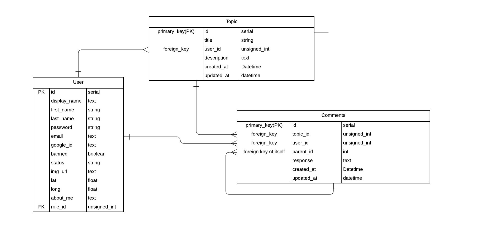

# Cannect (backend)

Cannect is a cannabis farmers application with the goal to connect cannabis farmers around the globe through collaboration and research. 

## Built With

1. Node.js - a javascript runtime
2. Express - framework for Node.js
3. Knex - SQL query builder
4. PostgreSQL - relational database management system 

## Database Relationships

The structure of the relationships are: 
- A user can have many topics and each topic belongs to only one user
- A user can have many comments and each comment belongs to only one user
- A topic can have many comments and each comment belongs to only one topic
- Each comment can have many other comments (children), but each comment can have only one parent comment 

## Authentication

In order to have user authentication through a gmail account the following packages were installed: 
 - passport
 - passport-google-oauth20
 - JWT 

In additional to installing the above packages, my .env folder holds a client-id and client-secret that was provided by setting up a project through the Google Cloud Platform. 

## Contributors 
The News API and Dark Sky API were used to gather weather data and news resources to improve user expierence. 

## Author
Catherine Clause
